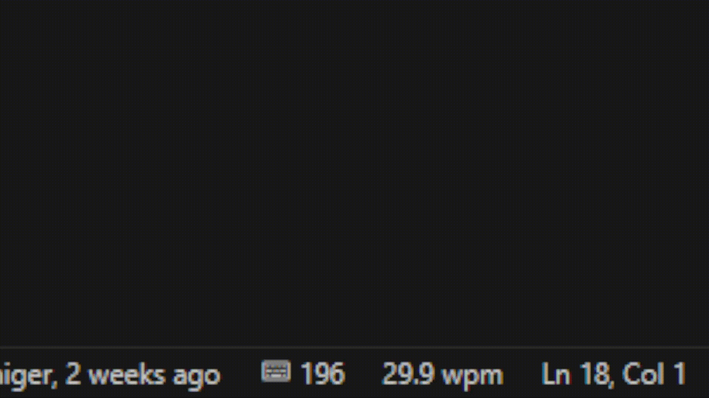
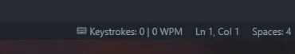

<a name="readme_top"></a>

# KCodeFlow - VSCode Extension

[![Contributors][contributors_shield]][contributors_url]
[![Forks][forks_shield]][forks_url]
[![Stargazers][stars_shield]][stars_url]
[![Issues][issues_shield]][issues_url]
<br>

[![Typescript][typescript_shield]][typescript_url]
[![VSCode-API][vscode_api_shield]][vscode_api_url]

## 📑 About the project

The project is a VSCode extension, that tracks your keystrokes, while coding. Do you really need it? Probably not. Is it fun to have? Definitely! 🤓 You can download it on the [VSCode-Marketplace](https://marketplace.visualstudio.com/items?itemName=mhouney.kcodeflow). Happy typing!

<p align="right">(<a href="#readme_top">back to top</a>)</p>

## ⚙️ Commands

- `KCodeFlow: Show Count-Analytics` - Shows the analytics of your keystrokes
- `KCodeFlow: Show most often pressed keys` - Shows the most often pressed keys

## 🔥 Features

### 📊 Keep track of your total keystrokes and wpm




### 📊 Show analytics


<p align="right">(<a href="#readme_top">back to top</a>)</p>

## 🐛 Known Issues

- Sometimes a test randomly fails. This is probably due to minimal timing changes while testing the wpm calculations.
- When selecting something from IntelliSense, then the selected text is counted as the keystroke.

## 🔢 Getting started

1. Clone the repository
   ```sh
   git clone https://github.com/MhouneyLH/KCodeFlow.git
   ```
2. Install the npm packages
   ```sh
   npm install
   ```
3. Run tests. (Optional)
   ```sh
   npm run test
   ```

<p align="right">(<a href="#readme_top">back to top</a>)</p>

## 👨🏻‍💼 Contributing

Contributions are always welcome! Please look at following commit-conventions, while contributing: https://www.conventionalcommits.org/en/v1.0.0/#summary 😃

1. Fork the project.
2. Pick or create an [issue](https://github.com/MhouneyLH/KCodeFlow/issues) you want to work on.
3. Create your Feature-Branch. (`git checkout -b feat/best_feature`)
4. Commit your changes. (`git commit -m 'feat: add some cool feature'`)
5. Push to the branch. (`git push origin feat/best_feature`)
6. Open a Pull-Request into the Develop-Branch.
<p align="right">(<a href="#readme_top">back to top</a>)</p>

<!-- Links and Images -->

[contributors_shield]: https://img.shields.io/github/contributors/MhouneyLH/KCodeFlow.svg?style=for-the-badge
[contributors_url]: https://github.com/MhouneyLH/KCodeFlow/graphs/contributors
[forks_shield]: https://img.shields.io/github/forks/MhouneyLH/KCodeFlow.svg?style=for-the-badge
[forks_url]: https://github.com/MhouneyLH/KCodeFlow/network/members
[stars_shield]: https://img.shields.io/github/stars/MhouneyLH/KCodeFlow.svg?style=for-the-badge
[stars_url]: https://github.com/MhouneyLH/KCodeFlow/stargazers
[issues_shield]: https://img.shields.io/github/issues/MhouneyLH/KCodeFlow.svg?style=for-the-badge
[issues_url]: https://github.com/MhouneyLH/KCodeFlow/issues
[typescript_shield]: https://img.shields.io/badge/TypeScript-007ACC
[typescript_url]: https://github.com/microsoft/TypeScript
[vscode_api_shield]: https://img.shields.io/badge/Made%20for-VSCode-1f425f.svg
[vscode_api_url]: https://code.visualstudio.com/api/references/vscode-api
